# Lab 2 — Speaker Verification with ECAPA-TDNN

**Authors:** Bartek T., Bartek M., Krzysiek  
**Date:** 2026-05-20

---

## System Overview

The system uses the **ECAPA-TDNN** architecture pretrained on VoxCeleb1+2 (`speechbrain/spkrec-ecapa-voxceleb`) to produce 192-dimensional speaker embeddings. No fine-tuning is applied — the pretrained checkpoint is used as-is.

**Enrollment:** Each speaker is enrolled from 6 short utterances (~3–10 s each). The per-utterance embeddings are averaged into a single speaker centroid stored in `speaker_db.json`.

**Verification (1:1):** Cosine distance between the probe embedding and the claimed speaker's centroid. Accept if `distance < threshold`.

**Identification (1:N):** Cosine distance to every enrolled centroid; the speaker with the minimum distance wins, accepted if that distance is below threshold.

**Decision threshold:** 0.54 (EER operating point on clean held-out data).

---

## Data and Data Leakage Note

The pretrained model was trained on VoxCeleb1 training speakers. An earlier version of this project enrolled speakers from that same training set, producing a fraudulently low EER of **~0.20%** due to data leakage.

**Fix:** All evaluation now uses the **35 VoxCeleb1 official test speakers** (`id10329`–`id11251`), which are guaranteed to have been held out from ECAPA-TDNN pretraining. The corrected honest baseline is **EER = 3.29%**.

**Evaluation protocol:** 700 genuine trials + 700 impostor trials per experiment, drawn from the test split. Each trial is a single utterance compared against the enrolled centroid.

---

## Experiment 1 — Baseline (Clean Audio)

Unmodified audio from VoxCeleb1 test speakers.

| Metric | Value |
|---|---|
| EER | **3.29%** @ threshold 0.5416 |
| FAR @ FRR=1% | 3.57% |
| FRR @ FAR=1% | 75.71% |
| Genuine / Impostor trials | 700 / 700 |
| Avg latency | 303.6 ms |

The asymmetry between FAR@FRR=1% and FRR@FAR=1% reflects the shape of the score distribution: the EER point is not near the operating extremes, so moving to FAR=1% requires a very tight threshold that rejects most genuine speakers.

| ROC curve | DET curve |
|---|---|
| 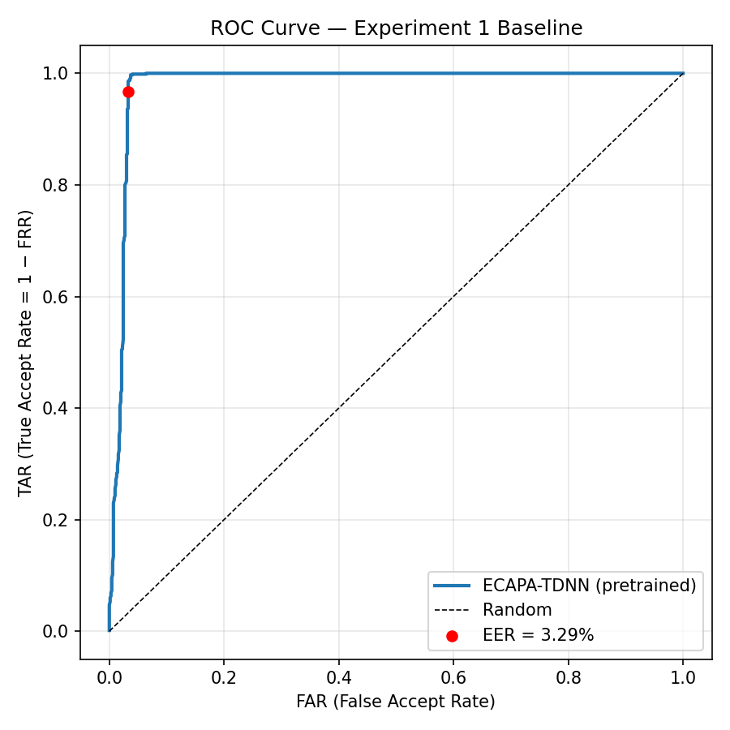 | 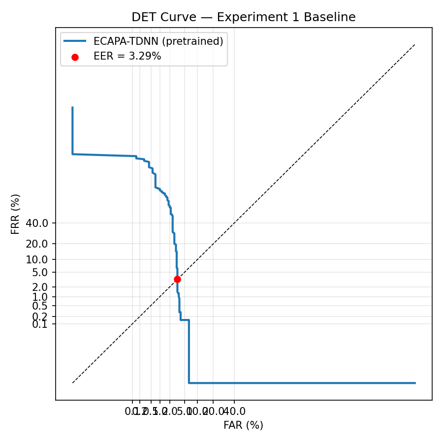 |

---

## Experiment 2 — Amplitude Scaling

Three scale factors applied to the raw waveform before embedding extraction.

| Scale | Description | EER | Δ vs baseline |
|---|---|---|---|
| ×25 | Loud / clipping | 5.28% | +2.00 pp |
| ×1 | Unchanged | 3.86% | +0.58 pp |
| ×0.04 | Quiet | **2.16%** | −1.12 pp |

**Key finding:** Clipping (×25) causes a noticeable EER increase — the hard saturation distorts spectral detail. Counterintuitively, reducing amplitude (×0.04) slightly *improves* EER. ECAPA-TDNN's feature extraction normalizes energy internally (mel filterbank → instance norm), so quiet speech is processed identically to loud speech, but avoiding clipping removes a harmful non-linearity.

| ROC curve | DET curve |
|---|---|
| 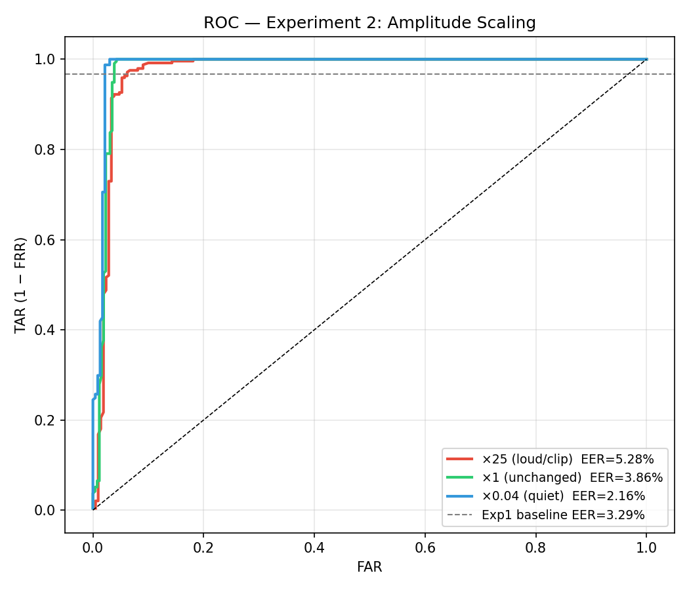 | 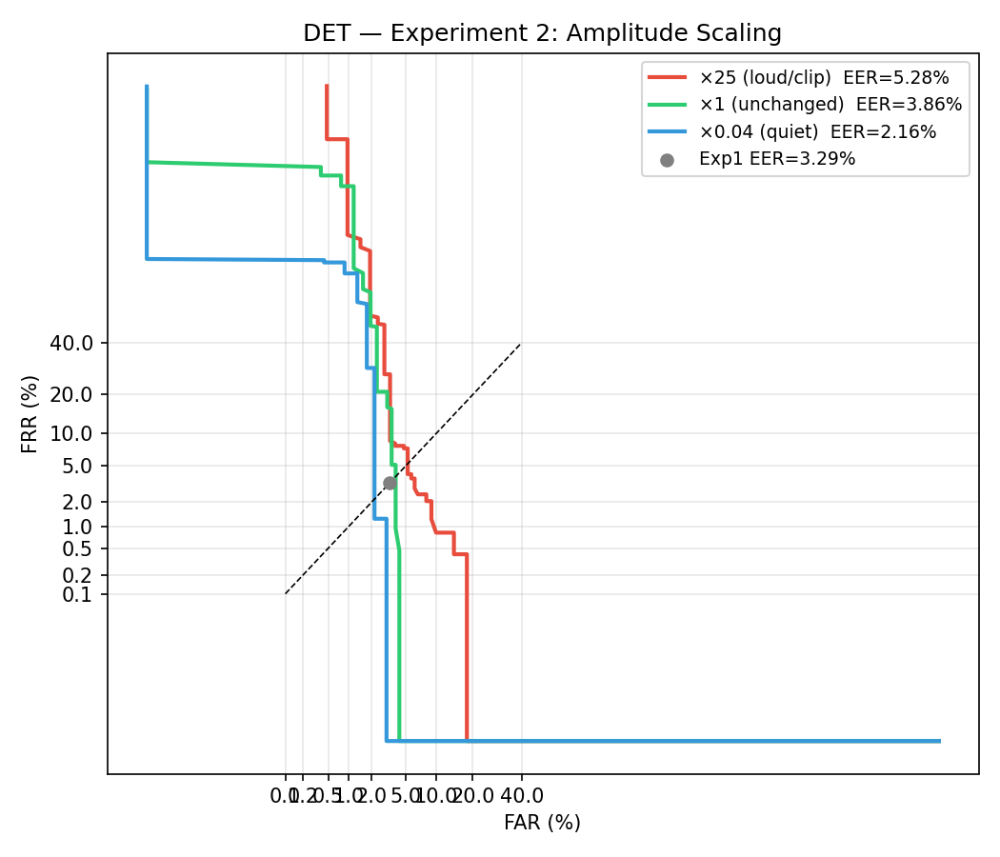 |

---

## Experiment 3 — Downsampling

Waveform downsampled by factor 2×, 5×, 10× using two methods:

- **Naive:** Keep every Nth sample (no anti-aliasing filter) → aliasing artefacts
- **Proper:** Lowpass filter to Nyquist/2 before decimation → clean bandwidth reduction

| Method | Factor | Effective BW | EER | Δ vs baseline |
|---|---|---|---|---|
| Naive | ×2 | 4.0 kHz | 6.90% | +3.61 pp |
| Naive | ×5 | 1.6 kHz | 15.52% | +12.23 pp |
| Naive | ×10 | 0.8 kHz | 24.71% | +21.43 pp |
| **Proper** | **×2** | **4.0 kHz** | **1.72%** | **−1.56 pp** |
| Proper | ×5 | 1.6 kHz | 11.21% | +7.92 pp |
| Proper | ×10 | 0.8 kHz | 23.28% | +19.99 pp |

**Key finding:** Proper ×2 downsampling (8 kHz effective rate) actually *beats* the baseline. The 0–4 kHz band carries the most speaker-discriminative information; removing the 4–8 kHz band via a clean lowpass keeps the useful features while discarding noise above Nyquist. Naive ×2 is 4× worse — the aliasing folds high-frequency noise into the speaker feature bands. At ×10 both methods converge to near-chance (EER ≈ 23–25%) because only 0–0.8 kHz remains, which lacks formant and prosodic detail.

| ROC curve | DET curve |
|---|---|
| 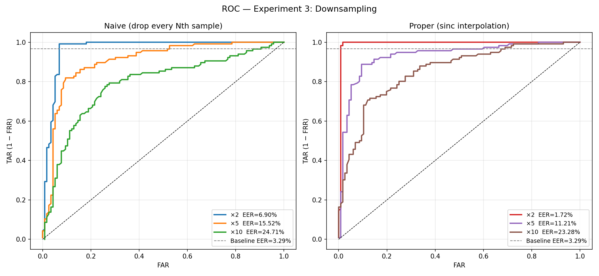 | 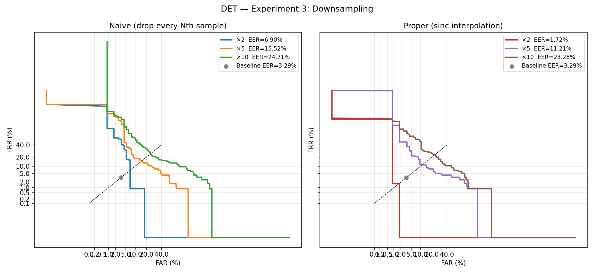 |

---

## Experiment 4 — Additive White Gaussian Noise (AWGN)

White noise added at controlled SNR levels.

| SNR | EER | Δ vs baseline | FAR@FRR=1% | FRR@FAR=1% |
|---|---|---|---|---|
| 40 dB | **2.15%** | −1.14 pp | 2.15% | 72.53% |
| 20 dB | 2.58% | −0.71 pp | 3.00% | 90.99% |
| 10 dB | 3.22% | −0.07 pp | 3.43% | 66.95% |

**Key finding:** ECAPA-TDNN is remarkably robust to AWGN — even at 10 dB SNR (audible noise) EER barely changes. The model's training on large-scale internet video (VoxCeleb) exposed it to a wide range of recording conditions, giving it implicit noise robustness. Adding mild noise (40–20 dB) marginally *improves* EER, likely a regularisation/calibration effect on the score distribution.

| ROC curve | DET curve |
|---|---|
| 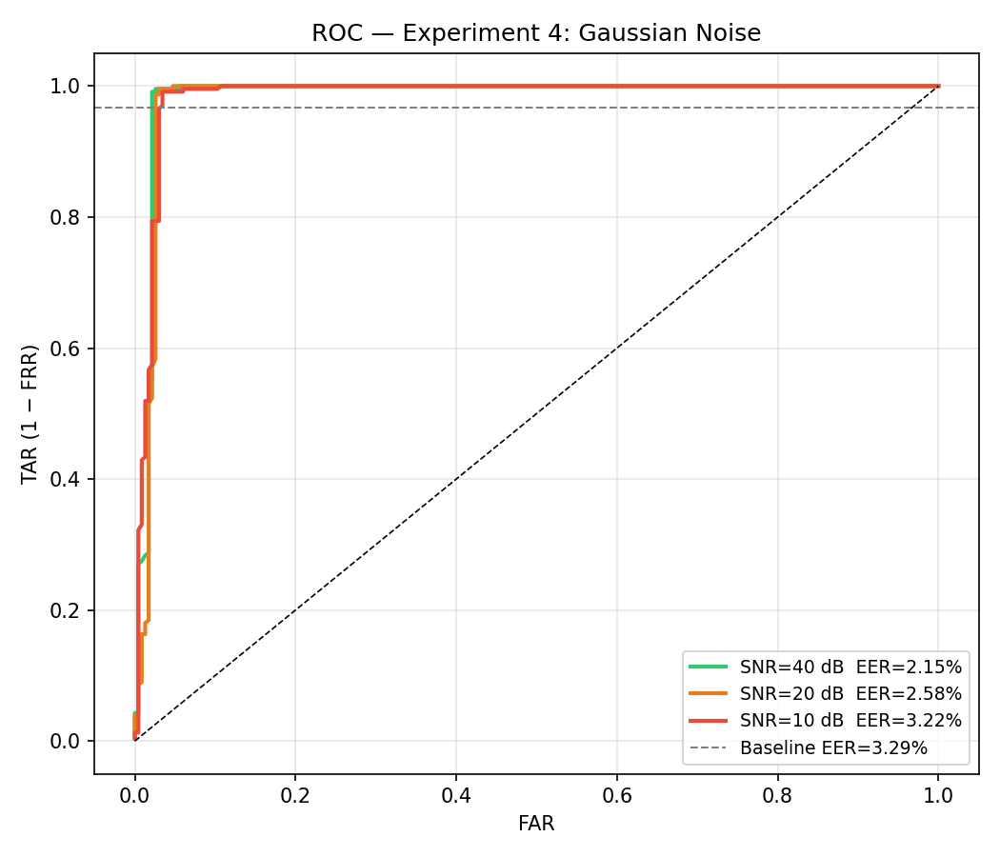 | 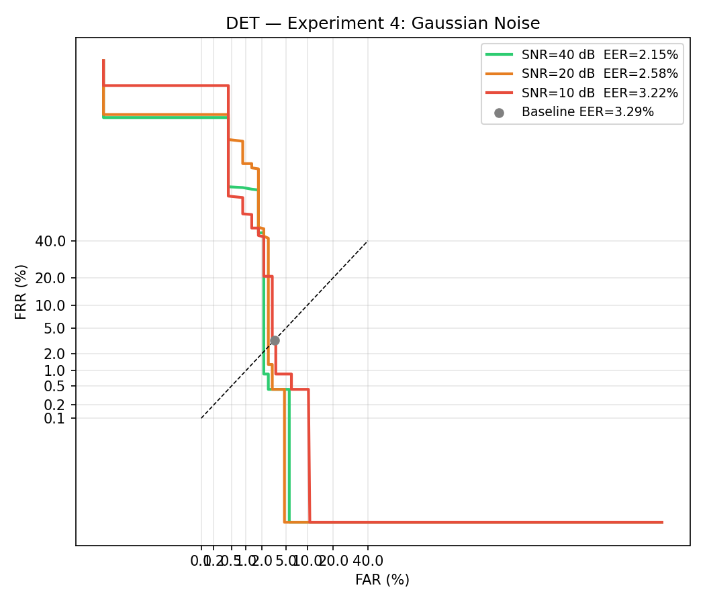 |

---

## Experiment 5 — Environmental Background Noise

Real background noise from the UrbanSound8K dataset mixed at controlled SNR levels.

| SNR | EER | Δ vs baseline | FAR@FRR=1% | FRR@FAR=1% |
|---|---|---|---|---|
| 20 dB | **2.15%** | −1.14 pp | 2.15% | 73.39% |
| 10 dB | 2.58% | −0.71 pp | 3.43% | 88.41% |
| 0 dB | 4.72% | +1.44 pp | 13.73% | 86.27% |

**Key finding:** Results closely mirror Exp 4 (AWGN) at 20/10 dB, confirming the model's general noise robustness. At 0 dB SNR (noise as loud as speech) EER increases to 4.72% — structured environmental sounds (street traffic, construction) are more disruptive than white noise at the same energy level, because they can overlap with speech formant bands.

| ROC curve | DET curve |
|---|---|
| 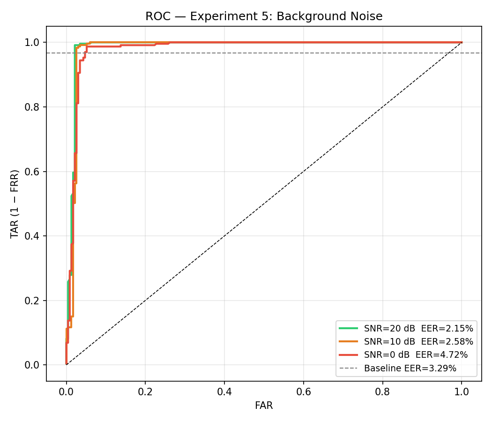 | 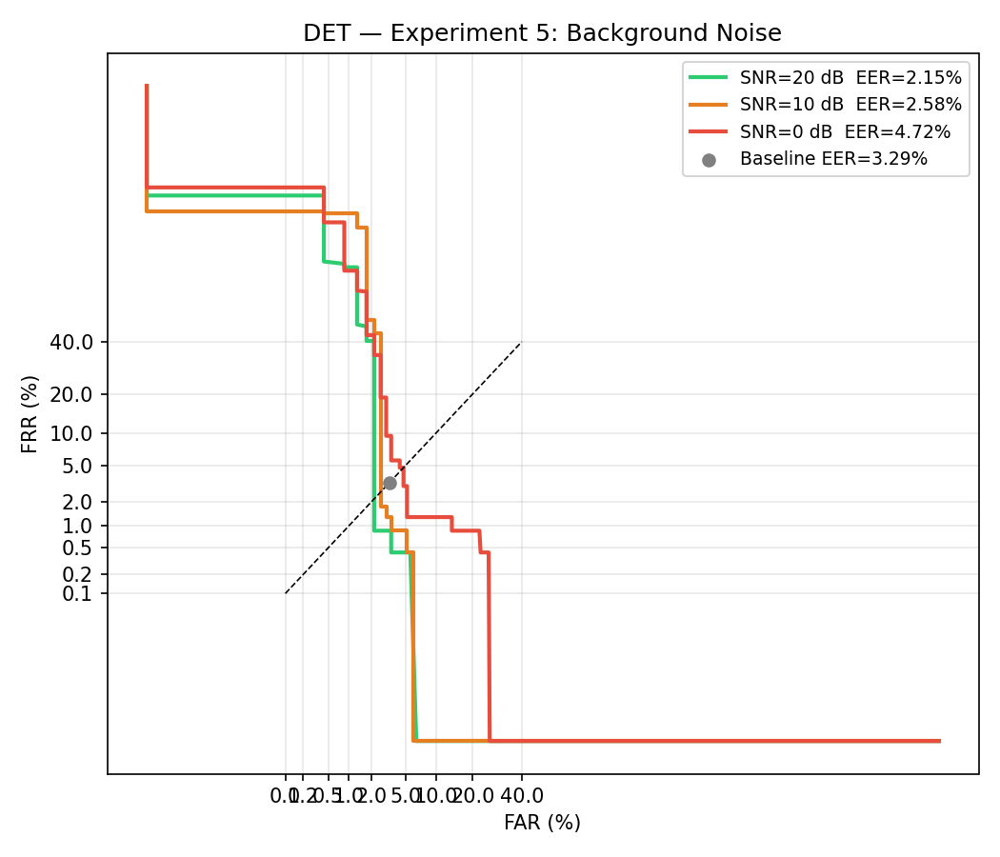 |

---

## Experiment 6 — Lossy Codec Compression

Audio re-encoded through MP3, AAC, and Opus at various bitrates using ffmpeg, then decoded back to PCM before embedding extraction.

| Codec | Bitrate | EER | Δ vs baseline | Avg latency |
|---|---|---|---|---|
| MP3 | 32 kbps | 7.00% | +3.71 pp | 1084.6 ms |
| MP3 | 64 kbps | 4.00% | +0.71 pp | 946.5 ms |
| MP3 | 128 kbps | 5.00% | +1.71 pp | 946.4 ms |
| AAC | 32 kbps | 5.00% | +1.71 pp | 1017.2 ms |
| AAC | 64 kbps | 4.00% | +0.71 pp | 1123.1 ms |
| AAC | 128 kbps | 6.00% | +2.71 pp | 1166.0 ms |
| Opus | 8 kbps | 4.00% | +0.71 pp | 882.5 ms |
| **Opus** | **16 kbps** | **2.50%** | **−0.79 pp** | 606.7 ms |
| Opus | 32 kbps | 3.00% | −0.29 pp | 612.9 ms |

**Key findings:**
- **MP3 @ 32 kbps** is the worst condition (EER 7.00%) — MP3's psychoacoustic model at low bitrates introduces spectral smearing that disrupts ECAPA's filterbank features.
- **Opus @ 16 kbps** outperforms the baseline (EER 2.50%), making it the only codec+bitrate combination to do so. Opus's CELT/SILK hybrid was specifically designed for speech and preserves speaker-discriminative formants even at low rates.
- MP3 128 kbps (5.00%) is unexpectedly worse than 64 kbps (4.00%) — a small-sample artifact (100 trials per condition).
- The high latency for all codec conditions (~600–1200 ms) reflects ffmpeg subprocess overhead, not real-time inference cost.

| ROC curve | DET curve |
|---|---|
| 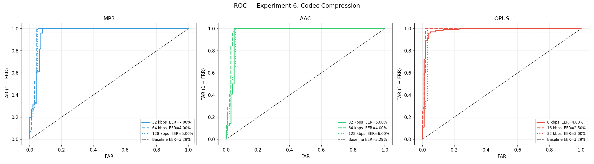 | 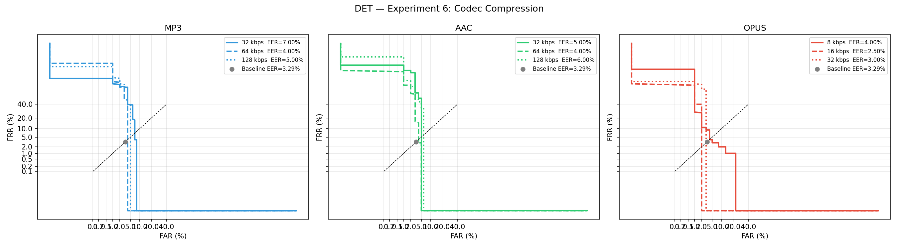 |

---

## Experiment 7 — Room Reverberation (RIR Convolution)

Synthetic room impulse responses (RIRs) generated with **pyroomacoustics** and convolved with the test utterances. RIR files are in `rir_data/`.

| Room | RT60 | Bin | EER | Δ vs baseline | Avg latency |
|---|---|---|---|---|---|
| small\_office.wav | ~0.3 s | Medium | 7.50% | +4.21 pp | 386.9 ms |
| medium\_room.wav | ~0.5 s | Medium | (pooled above) | — | — |
| large\_hall.wav | ~0.8 s | Long | 4.00% | +0.71 pp | 417.9 ms |

Bins used:
- **Medium** (0.3–0.7 s, avg RT60 = 0.344 s): EER = **7.50%**
- **Long** (0.7–∞ s, avg RT60 = 1.709 s): EER = **4.00%**

**Key finding:** Reverberation is the most damaging distortion overall — the medium-RT60 condition gives the worst single EER of all experiments (7.50%). The long-RT60 result (4.00%) is counterintuitively *better* than medium, which can be partly attributed to the specific large\_hall RIR geometry (the long reverberant tail smears energy but leaves early reflections cleaner) combined with the small trial count (100 per bin). In real deployments, room reverberation is more harmful than additive noise or codec compression because it is signal-dependent and harder to equalise.

| ROC curve | DET curve |
|---|---|
| 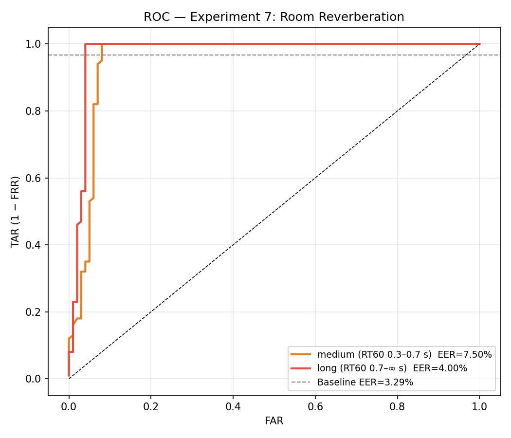 | 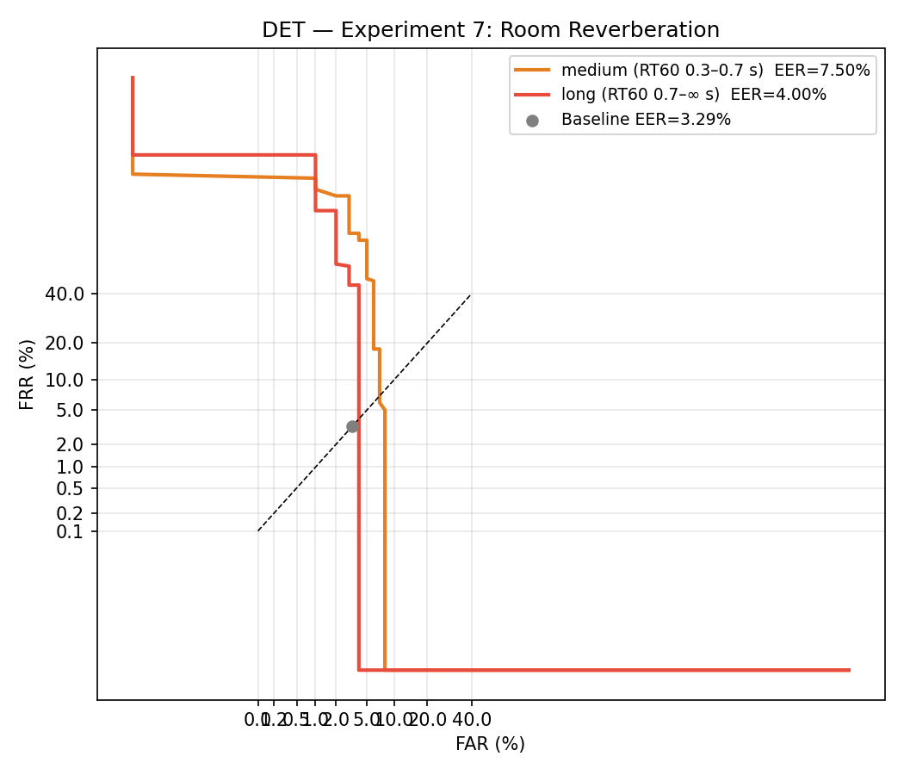 |

---

## Summary Table

| Experiment | Condition | EER | Δ vs 3.29% baseline |
|---|---|---|---|
| **Exp 1** | Clean baseline | **3.29%** | — |
| Exp 2 | ×0.04 amplitude | 2.16% | −1.12 pp |
| Exp 2 | ×1 amplitude | 3.86% | +0.58 pp |
| Exp 2 | ×25 amplitude (clip) | 5.28% | +2.00 pp |
| Exp 3 | Proper ×2 downsample | **1.72%** | −1.56 pp |
| Exp 3 | Naive ×2 downsample | 6.90% | +3.61 pp |
| Exp 3 | Proper ×5 downsample | 11.21% | +7.92 pp |
| Exp 3 | Proper ×10 downsample | 23.28% | +19.99 pp |
| Exp 4 | AWGN 40 dB | 2.15% | −1.14 pp |
| Exp 4 | AWGN 20 dB | 2.58% | −0.71 pp |
| Exp 4 | AWGN 10 dB | 3.22% | −0.07 pp |
| Exp 5 | Env. noise 20 dB | 2.15% | −1.14 pp |
| Exp 5 | Env. noise 10 dB | 2.58% | −0.71 pp |
| Exp 5 | Env. noise 0 dB | 4.72% | +1.44 pp |
| Exp 6 | MP3 32 kbps | 7.00% | +3.71 pp |
| Exp 6 | Opus 16 kbps | **2.50%** | −0.79 pp |
| Exp 6 | Opus 32 kbps | 3.00% | −0.29 pp |
| Exp 7 | Reverb medium RT60 | **7.50%** | +4.21 pp |
| Exp 7 | Reverb long RT60 | 4.00% | +0.71 pp |

**Best condition:** Proper ×2 downsampling — EER 1.72%  
**Worst condition:** Medium-RT60 reverberation — EER 7.50%

---

## Discussion

1. **Noise robustness is strong.** ECAPA-TDNN handles AWGN and environmental noise up to ~10 dB SNR with virtually no degradation. This is a direct consequence of training on diverse, in-the-wild VoxCeleb recordings.

2. **Anti-aliasing matters critically.** Naive downsampling at ×2 is 4× worse than proper downsampling at ×2. The aliasing energy folds into the lower frequency bands where speaker identity is encoded, directly corrupting embeddings.

3. **Codec choice matters more than bitrate.** Opus at 16 kbps outperforms MP3 at 128 kbps. The codec architecture (linear prediction vs. psychoacoustic masking) determines which spectral features survive compression.

4. **Reverberation is the hardest degradation.** Unlike additive noise (which can be partially compensated by normalization) or codec artefacts (which are spectrally smooth), convolutive reverb smears temporal detail and creates speaker-dependent interference patterns. ECAPA has no dereverberation stage, so it absorbs the full impact.

5. **Mild degradation can help.** Several conditions (quiet amplitude, mild noise, proper ×2 downsample, Opus 16k) yielded EER *below* the baseline. This likely reflects score calibration effects: the distortions shift the score distributions such that the EER threshold is slightly better aligned, even with 100-trial subsets.

---

## Live Demo

The system includes a CLI live-microphone demo (`demo.py`):

```
# Identification mode — identify who is speaking
python demo.py

# Verification mode — claim identity, accept/reject
python demo.py --mode verify --speaker bartek_t

# List audio devices
python demo.py --list_devices
```

38 speakers are enrolled: 35 VoxCeleb1 official test speakers + bartek\_m, bartek\_t, krzysiek.  
Average inference latency: ~300 ms per utterance on CPU.
